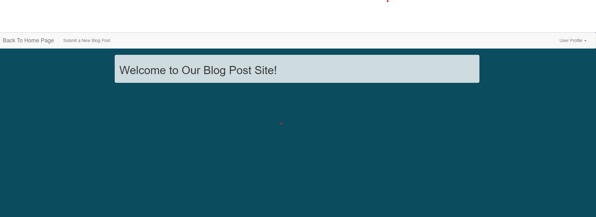
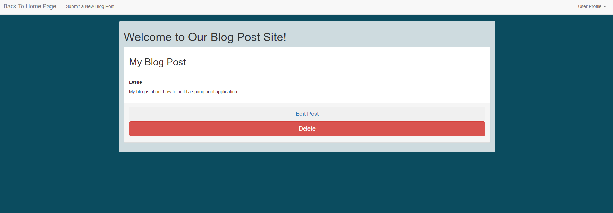
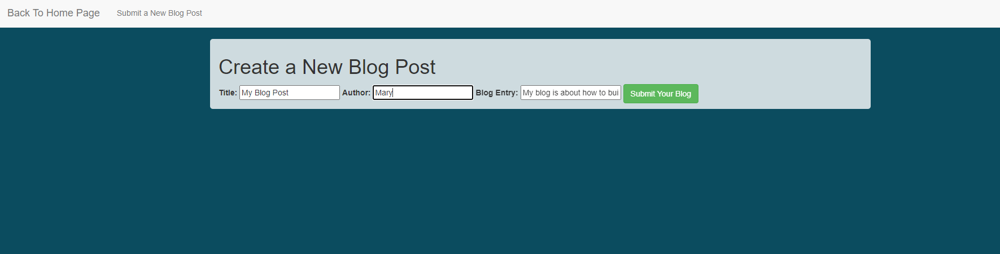
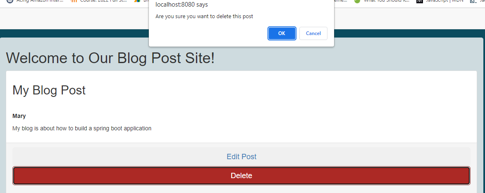

# TechTalentBlog
  
  ## Table of Contents
  * [Description](#description)
  * [Installation](#installation)
  * [Usage](#usage)
  * [Licenses](#licenses)
  * [Tests](#tests)
  * [Contributors](#contributors)
  * [Credits](#credits)
  * [Languages](#languages)
  
   
  
  
  
   
  
   
   
     
  
   
   
    
   
     
  
  
   ## Description
  A blogging web application that allows users to create, edit , submit and delete a blog post
  
  
   ## Installation
  IDE Eclipse 
  Spring Tool Suite to create a Spring App
  
  
   ## Usage
   Right click on the TechTalentBlog and select Run as Spring Boot app.
   Notice in console , the server should start.
   Open a web browser for instance google chrome and navigate to localhost:8080/
   
   
   ## Licenses
   This project is covered under the MIT license. To learn more click the license button at the top.
  ## Contributors
  None, contact me by my email or github with any questions or want to contribute
  
  
  ## Tests
  NA
  
  
  ## Contributors  
  https://github.com/Halesy1019, https://github.com/cooljoebob64, https://github.com/yambaO
  
  
  ## Credits
  Haley, Yamba, Joshua 
  
  
   ## Languages
  Java , HTML5, CSS, JavaScript
  
  
  
  
  
   
 
